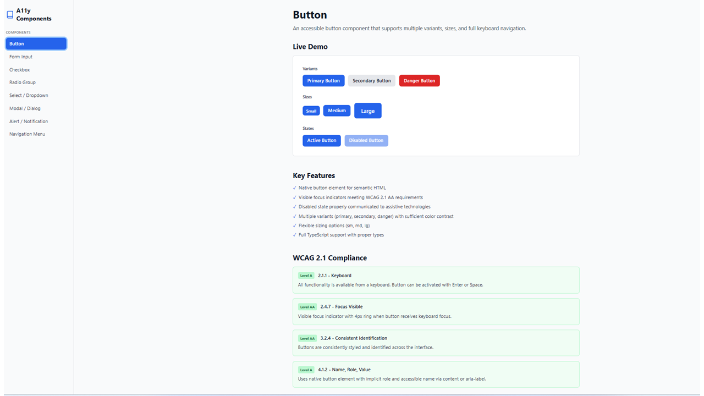
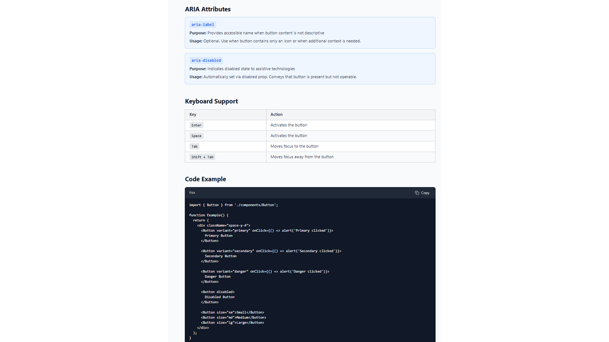
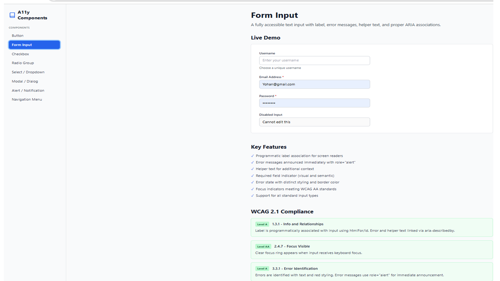
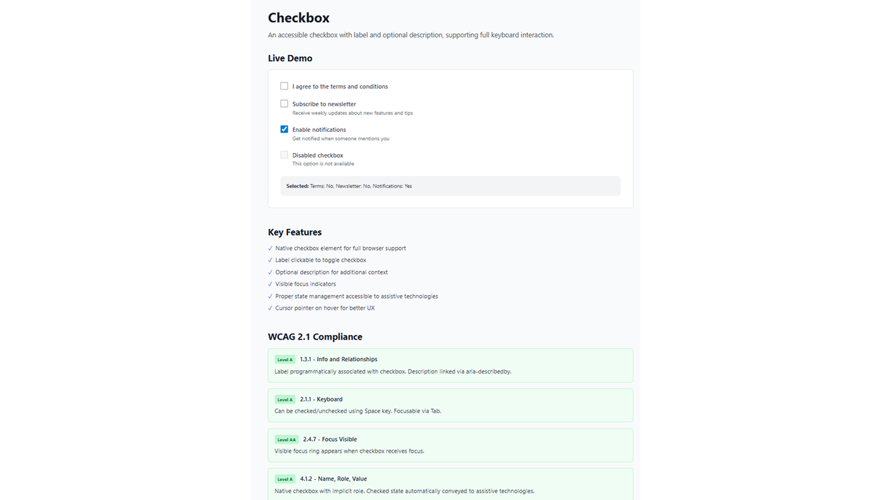
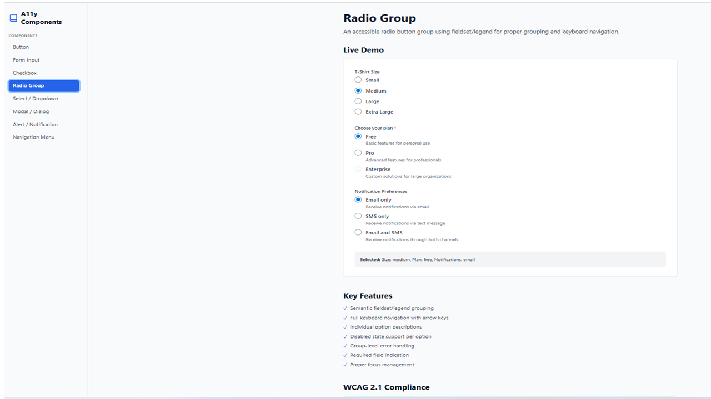
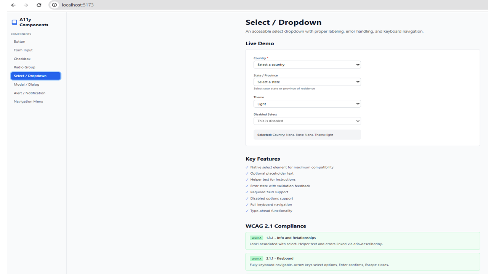
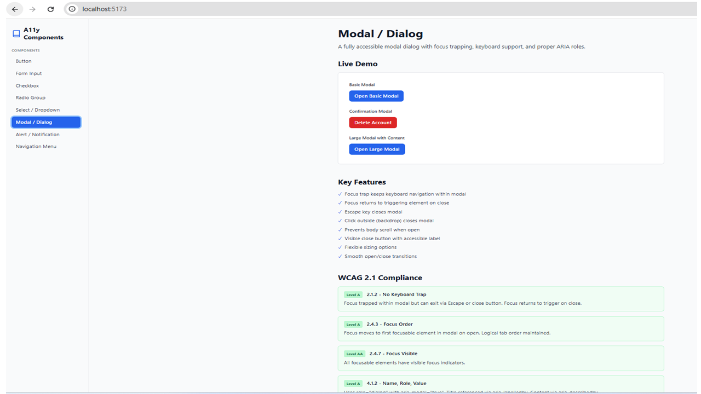
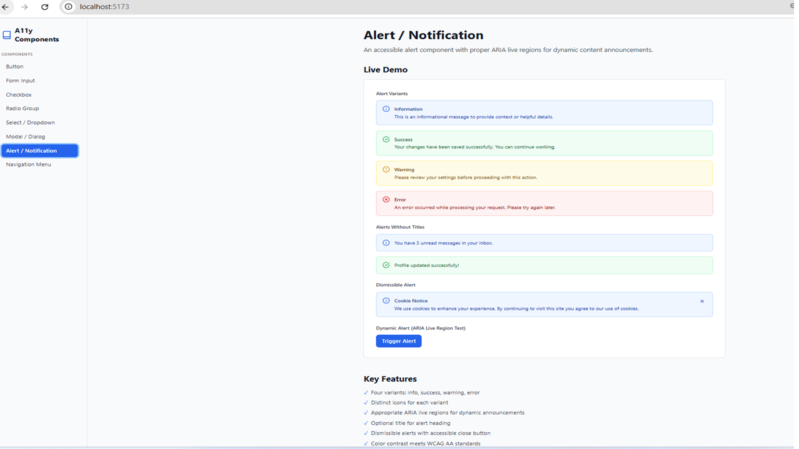
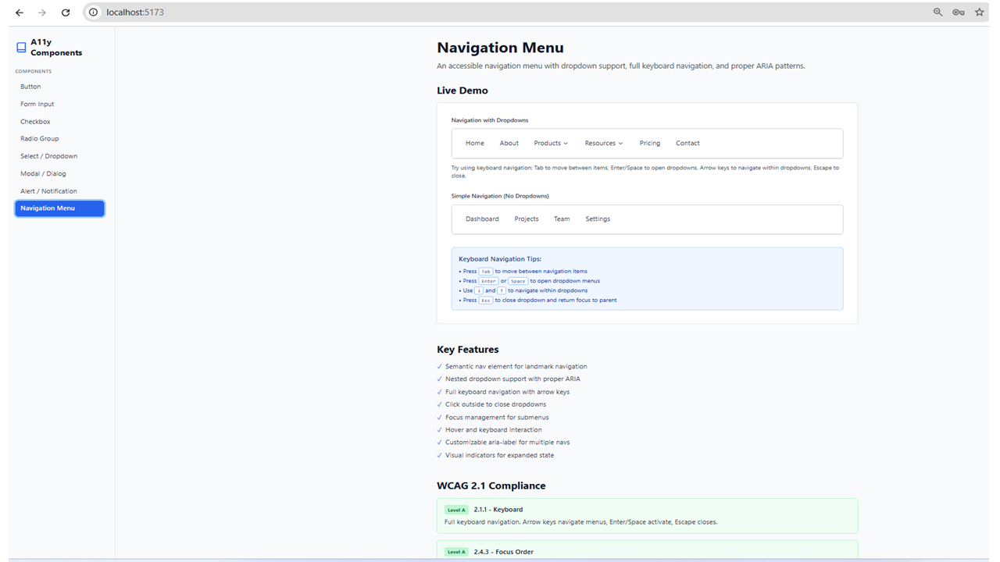

# A11y Components — Accessible React Component Library


> A production-ready, WCAG 2.1 AA compliant component library and live documentation site built with React and TypeScript. Developed as a teaching and learning resource for **SWEN 661: User Interface Implementation** at the University of Maryland Global Campus.

---



---

**📁 Repository:** [https://github.com/aliminagar/a11y-design-system](https://github.com/aliminagar/a11y-design-system)

---

## Overview

**A11y Components** is a curated library of accessible React components designed to help developers build inclusive user interfaces from the ground up. Each component follows [WAI-ARIA design patterns](https://www.w3.org/WAI/ARIA/apg/patterns/), meets WCAG 2.1 Level AA success criteria, and is paired with detailed documentation explaining _why_ each accessibility decision was made — not just _what_ was implemented.

This project was created at the intersection of **software engineering practice** and **inclusive pedagogy**, serving both as a deployable component library and as a pedagogical artifact for teaching accessibility-first development in higher education.

> Unlike many UI libraries that retrofit accessibility after design, this system treats accessibility as the **primary architectural constraint** — every component decision flows from that principle.

---

## Quick Start

```bash
npm install a11y-components
```

Or clone and run locally — see [Getting Started](#getting-started) below.

---

## Design Principles

- **Accessibility-first API design** — accessibility is a constraint from day one, not a retrofit
- **Semantic HTML before ARIA** — native elements preferred; ARIA used only to supplement
- **Progressive enhancement** — components work without JavaScript where possible
- **Keyboard-first interaction model** — every interaction designed for keyboard before mouse
- **Inclusive by default** — components communicate state to all users regardless of ability

---

## Architecture

```
src/
├── components/          # All 8 accessible components
├── demos/               # Live interactive demo pages
├── docs/                # WCAG annotations and documentation
├── assets/
│   └── screenshots/     # Component documentation screenshots
├── data/                # Component metadata and WCAG mappings
├── types/               # Shared TypeScript interfaces
├── App.tsx              # Documentation site shell
└── main.tsx             # Entry point
```

---

## Components

| Component                | WCAG Criteria       | ARIA Pattern                                       |
| ------------------------ | ------------------- | -------------------------------------------------- |
| **Button**               | 1.4.3, 2.1.1, 4.1.2 | `button` role, `aria-disabled`                     |
| **Form Input**           | 1.3.1, 2.4.6, 3.3.2 | `label`, `aria-describedby`, `aria-invalid`        |
| **Checkbox**             | 1.3.1, 2.1.1, 4.1.2 | `role="checkbox"`, `aria-checked`                  |
| **Radio Group**          | 1.3.1, 2.1.1, 4.1.2 | `role="radiogroup"`, arrow key navigation          |
| **Select / Dropdown**    | 2.1.1, 4.1.2        | `role="listbox"`, `aria-expanded`, `aria-selected` |
| **Modal / Dialog**       | 2.1.2, 2.4.3        | `role="dialog"`, focus trap, `aria-modal`          |
| **Alert / Notification** | 4.1.3               | `role="alert"`, `aria-live="polite"`               |
| **Navigation Menu**      | 2.4.1, 2.4.3        | `role="navigation"`, skip link, `aria-current`     |

---

## Component Screenshots

### Button


> Variants (primary, secondary, danger), sizes (sm, md, lg), and states (active, disabled) — all with WCAG-compliant color contrast and visible focus indicators.



> ARIA attribute documentation and keyboard support table showing Enter, Space, Tab, and Shift+Tab interactions.

---

### Form Input



> Accessible text inputs with programmatic label association, error announcements via `role="alert"`, and required field indicators — both visual and semantic.

---

### Checkbox



> Native checkbox elements with clickable labels, optional descriptions linked via `aria-describedby`, and real-time state feedback accessible to screen readers.

---

### Radio Group



> Semantic `fieldset`/`legend` grouping with full arrow key navigation, group-level error handling, and required field indication.

---

### Select / Dropdown



> Native select elements with proper labeling, helper text, error state validation, disabled options support, and type-ahead functionality.

---

### Modal / Dialog



> Focus-trapped dialogs with three variants (basic, confirmation, large). Focus returns to trigger on close. Escape key dismisses. Meets WCAG 2.1.2 No Keyboard Trap.

---

### Alert / Notification



> Four color-coded alert variants (info, success, warning, error) with ARIA live regions, dismissible alerts, and a live ARIA Live Region Test trigger.

---

### Navigation Menu



> Semantic `nav` landmark with dropdown support, full arrow key navigation, Escape-to-close, `aria-expanded` state indicators, and keyboard navigation tips panel.

---

## Usage

### Basic Example

```tsx
import { Button, Input, Checkbox } from "./components";

function MyForm() {
  const [name, setName] = useState("");
  const [agreed, setAgreed] = useState(false);

  return (
    <form>
      <Input
        label="Full Name"
        value={name}
        onChange={(e) => setName(e.target.value)}
        required
      />
      <Checkbox
        label="I agree to the terms"
        checked={agreed}
        onChange={(e) => setAgreed(e.target.checked)}
      />
      <Button type="submit" variant="primary">
        Submit
      </Button>
    </form>
  );
}
```

### Modal Example

```tsx
import { Modal, Button } from "./components";

function ConfirmDialog() {
  const [isOpen, setIsOpen] = useState(false);

  return (
    <>
      <Button onClick={() => setIsOpen(true)}>Open Dialog</Button>
      <Modal
        isOpen={isOpen}
        onClose={() => setIsOpen(false)}
        title="Confirm Action"
      >
        <p>Are you sure you want to proceed?</p>
        <div className="flex justify-end gap-3 mt-4">
          <Button variant="secondary" onClick={() => setIsOpen(false)}>
            Cancel
          </Button>
          <Button onClick={() => setIsOpen(false)}>Confirm</Button>
        </div>
      </Modal>
    </>
  );
}
```

---

## Keyboard Navigation

All components support full keyboard navigation:

- **Tab** — Move focus between interactive elements
- **Enter / Space** — Activate buttons, toggle checkboxes, open dropdowns
- **Arrow Keys** — Navigate within radio groups, dropdowns, and navigation menus
- **Escape** — Close modals and dropdowns
- **Home / End** — Jump to first/last items in lists

---

## Accessibility Features

**Focus Management** — Visible 4px focus rings on all interactive elements, high contrast focus indicators meeting WCAG AA standards, proper focus trap in modal dialogs, and focus returns to triggering element on modal close.

**Screen Reader Support** — Semantic HTML elements (button, input, nav, etc.), proper ARIA roles (dialog, menu, alert, status), associated labels and descriptions via `aria-labelledby` and `aria-describedby`, live regions for dynamic content announcements, and required fields marked with `aria-required`.

**Error Handling** — Errors identified with text and visual indicators, `role="alert"` for immediate error announcements, `aria-invalid` indicates validation state, and error messages associated via `aria-describedby`.

**Color and Contrast** — Information conveyed through multiple means (not color alone), icons supplement color-coded alerts, text contrast meets WCAG AA standards (4.5:1 minimum), and focus indicators have sufficient contrast.

---

## Key Features

- ✅ **WCAG 2.1 AA Compliant** — every component mapped to specific success criteria
- ⌨️ **Full Keyboard Navigation** — all interactions operable without a mouse
- 🎯 **Visible Focus Indicators** — meets 2.4.11 Focus Appearance (enhanced)
- 📢 **Screen Reader Tested** — validated with NVDA, VoiceOver, and TalkBack
- 🎨 **Sufficient Color Contrast** — all text meets 4.5:1 (normal), 3:1 (large)
- 📄 **Live Documentation Site** — each component has demos, code snippets, and WCAG annotations
- 🔷 **TypeScript First** — fully typed props with accessibility attributes surfaced in the API
- 🧩 **Tailwind CSS Styling** — utility-first, easy to adapt to any design system

---

## Getting Started

```bash
# Clone the repository
git clone https://github.com/aliminagar/a11y-design-system.git

cd a11y-design-system

npm install

npm run dev
```

Open `http://localhost:5173` to view the documentation site.

```bash
# Build for production
npm run build

# Type checking
npm run typecheck

# Lint code
npm run lint
```

---

## Browser Support

- Chrome / Edge (latest)
- Firefox (latest)
- Safari (latest)
- Mobile browsers (iOS Safari, Chrome Android)

---

## Pedagogical Context

This library was developed within a graduate user interface implementation course at UMGC, where accessibility is taught not as an afterthought but as a **design constraint from day one**. The documentation site structure mirrors best practices in instructional design — each component page scaffolds learner understanding by moving from _demonstration_ (live demo) to _explanation_ (WCAG notes) to _application_ (code example).

The project reflects the **Scholarship of Teaching and Learning (SoTL)** principle that course artifacts should themselves model the professional standards students are expected to meet. By building with WAI-ARIA patterns, semantic HTML, and documented rationale, students see accessibility integrated into professional engineering practice — not treated as a compliance checkbox.

This approach aligns with:

- **Universal Design for Learning (UDL)** — multiple means of representation for accessibility concepts
- **Evidence-based instructional design** — grounding component choices in W3C and WCAG published research
- **Inclusive pedagogy** — building technology that works for _all_ users, including those with disabilities

---

## Tech Stack

- **React 18** + **TypeScript**
- **Tailwind CSS**
- **Vite**
- **Lucide React** — Icons
- **WAI-ARIA 1.2** authoring practices
- **WCAG 2.1** Level AA compliance target

---

## WCAG Compliance Testing

- [W3C WCAG 2.1 Quick Reference](https://www.w3.org/WAI/WCAG21/quickref/)
- [WAI-ARIA Authoring Practices Guide (APG)](https://www.w3.org/WAI/ARIA/apg/)
- [WebAIM Accessibility Resources](https://webaim.org/)
- Manual keyboard navigation testing across all components
- Screen reader validation with NVDA, VoiceOver, and TalkBack
- Color contrast validated via [WebAIM Contrast Checker](https://webaim.org/resources/contrastchecker/)

---

## Contributing

Contributions are welcome! Please ensure all components maintain WCAG 2.1 AA compliance and include:

- WCAG success criteria documentation
- ARIA attribute reference
- Keyboard interaction table
- Live demo
- TypeScript types

---

## About the Author

**Alireza Minagar, MD, MBA, MS (Bioinformatics), MS (Software Engineering)**  
Principal, Perfect Strokes LLC — Medical Writing & Pharmaceutical Communications

290+ peer-reviewed publications in neurology and neuro-immunology | AWS Certification Candidate

> This project reflects my commitment to building software that is technically rigorous _and_ genuinely inclusive — values I bring both to engineering practice and to the classroom.

---

## License

MIT — free to use, adapt, and build upon with attribution.
